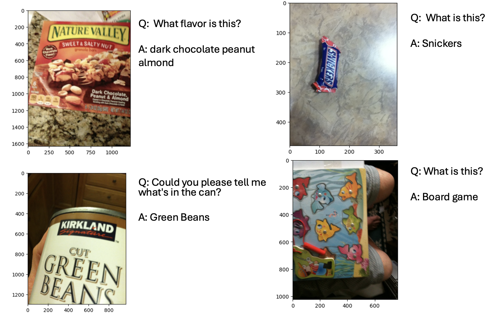

# Visual Question Answering

VizWiz VQA final challenge for Matsuo-Iwasawa lab's Deep Learning Fundamentals course.

Submitted report can be found [here](report/report.pdf).

### Update (2024/11/07)
Awarded the Excellence Award（優秀賞） from Matsuo-Iwasawa lab's Deep Learning Fundamentals course.


## Inference
Here are some examples of the model's inference.



## Notebooks
Notebooks can be found [here](notebooks).
These notebooks are meant to run in Google Colab environment and is mainly used in this implementation.

Although only PaliGemma fine-tuning was implemented in `src`, you can find implementation of CLIP models in `notebooks`.

## Implementation
1. Download necessary data

Download `valid.zip`, `train.zip`, `train.json`, and `valid.json` from `dl-common` GCS bucket.
```bash
make get_data
```

2. Unzip data, create directories, and add .env file

Unzipping data download from `1.`, setting `.env` file, and create
```bash
make setup
```

3. Add Hugging face token to .env file

Make sure Hugging Face account has access to [Google's PaliGemma model](https://huggingface.co/google/paligemma-3b-pt-224).

```bash
vim .env
```

4. Install dependencies

Installing packages not pre-installed in machine.
```bash
make install_packages
```

5. Eval best model

This command will evaluate model that was implemented previously and saved in ~~[howarudo's hugging face repo](https://huggingface.co/howarudo/paligemma-3b-pt-224-vqa-continue-ft-0)~~
[new highest score HF repo](https://huggingface.co/howarudo/paligemma-vqa-ft-colab-3e4-epoch_1).

```bash
make evaluate
```

6. Train from `src`

First, you have to add HF_TOKEN and edit the HF_PATH to be pushed in `params.py` (FINETUNED_MODEL_ID).
```bash
make train
```


## Report
Submitted report can be found [here](report/report.pdf).
In addition to the report, please read further discussion below.

~~The best result is stored in [submission](submission/submitted.npy), which achieved an accuracy of 0.72783 in the test dataset.~~

### Further Analysis (2024/07/17)
It was mentioned in the report that further hyperparameter tuning could result in a better accuracy.
After further hyperparameter tuning, testing with different learning rates, an accuracy of 0.75458 was acheived, and results are stored in [submission](submission/new_submitted.npy).

| Learning Rate | Epoch |VizWiz Accuracy  |
| ------------- |:-------------:| -----:|
|$3 \times 10^{-4}$| 0 |0.724|
||**1**|**0.754**|
||2|0.725|
||3|0.713|
||4|0.717|
||5|0.696|
||6|0.721|
||7|0.721|
|$3 \times 10^{-5}$| 0 |0.708|
||1|0.719|
||2|0.731|
||3|0.720|
||4|0.710|
||5|0.694|
||6|0.695|
||7|0.695|

In addition to testing with other learning rates, implementation of scheduler to further tune learning rate could also lead to a better result. Additional epochs (\~20) should also be tested if computationally possible. Finally, trying other decoders could also improve accuracy.
